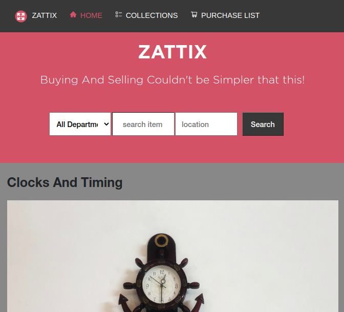
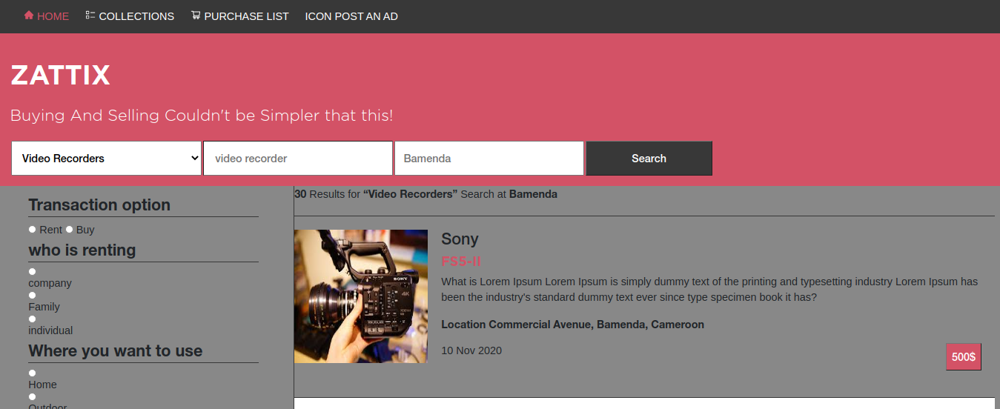

## Capstone-ZATTIX-Online-Shop

    This project was built based on the Layout, Typography and Colors of the ZATTIX online shop.

    Break Points:

    Mobile Site - Minimum Width - 375px
    Tablet Site - Minimum Width - 768px
    Desktop Site - Minimum Width - 992px

## Built With

- Html
- CSS
- Bootstrap
- Linter
- VS Code

## Live Demo

[Live Demo Link](https://raw.githack.com/wandji20/Capstone-Online-Shop/feature-branch/index.html)

## Author

# Wandji Bertrand

- Github: [@wandji20]
- Twitter: [@wandjibertrand]

## 🤝 Contributing

Contributions, issues and feature requests are welcome! Start by:

- Forking the project
- Cloning the project to your local machine
- `cd` into the project directory
- Run `git checkout -b your-branch-name`
- Make your contributions
- Push your branch up to your forked repository
- Open a Pull Request with a detailed description to the feature branch of the original project for a review

## Show your support

Give a :star: if you like this project!
